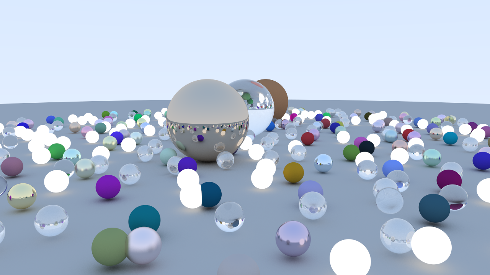

My pathtracer using a WGPU.

Works on Linux and Windows. However, so far this doesn't work on Mac.

---

Overall Features:

- BVH
- Multisampling
- Realtime and offline rendering
- Scenes
- Supports only Sphere geometry
- Available materials are Lambertians, Metals, Glass, and Lights
- Change day to night in src/renderer/compute.wgsl file in the `miss()` function

Realtime features: 

- Camera movement [WASD]
- Camera rotation [Right-click + mouse]
- Screenshot [z]
- Change scenes using [0-9] number keys
- Change sample count and max depth in settings.ron

Offline features: 

- Change resolution in src/bin/offline.rs file
- Defaults to scene 1. Can be change in offline.rs
- Change sample count in source or in settings.ron [^1]
- Change max depth also in settings.ron

[^1]: Changing sample count in source is recomended, because it is more CPU side and will not hog the GPU. This allows other programs to use your GPU.